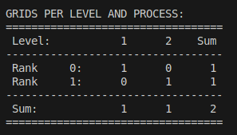

## How to reproduce
- Install Catalyst: https://catalyst-in-situ.readthedocs.io/en/latest/build_and_install.html
    - All flags are listed in catalyst-flags.txt
- Compile Paraview with PARAVIEW_ENABLE_CATALYST:BOOL=ON
    - Version used: 5.13.1-749-g7d48519d05 (see paraview-version.txt)
    - All flags are listed in paraview-config.txt
- Go to /minimal-example and run the commands:
    ```
    mkdir build
    cd build
    cmake ..
    make
    mpirun -n 2 ./bin/reproducer
    ```
- Faulty behavior:
    - When a refinement level does not hold a grid on some MPI rank, then an assertion is triggered and the program segfaults later in the Conduit --> VTK conversion
    - The minimal example holds one grid on MPI rank 0 on level 1 and one grid on MPI rank 1 on level 2, see 
- Expected behavior:
    - Healthy dataout.vthb file that correctly interprets the AMR mesh as described in Conduit
    - The Conduit --> VTK conversion automatically recognizes that some levels may not be represented on some MPI ranks