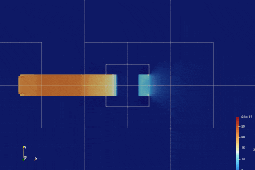

# Catalyst and MGLET



*In-Situ visualization with [Paraview Catalyst](https://docs.paraview.org/en/latest/Catalyst/index.html) integrated in MGLET. Data fields are not written to disk during simulation. Catalyst establishes a direct link into the simulation memory by pointers and extracts images based on [Paraview](https://www.paraview.org/)'s visualization pipeline.*

## Workflow

Running Catalyst alongside a simulation can be archieved by providing a simple configuration in the parameters `JSON` file required by MGLET. The configuration supports the following arguments
- `fields`: List of field names that shall be captured by Catalyst
- `writevtkfile` [Optional]: Boolean whether catalyst shall create a representative dataset
- `scripts` [Optional]: List of paths to Catalyst pipeline Python scripts

The following snippet shows an example on how such a configuration could look like:

```json
{
    // Snip: Simulation parameters (e.g. flow, time)

    "catalyst": {
        "fields": ["U", "V", "W", "P"],
        "writevtkfile": false,
        "scripts": [
            "catalyst_pipeline.py",
            "another_script.py"
        ]
    }
}
```

*Currently not supported: Arguments to Catalyst Scripts.*
### Preparing a Simulation with Catalyst

:information_source: Currently, the MGLET integration with Catalyst requires the total number of grids to be divisible by the number of MPI ranks. 

#### Creating a representative dataset

Before running the complete simulation with Catalyst, a representative dataset must be created. This dataset serves as a reference for paraview and the user to set up the pipeline script which is used to specify e.g. which fields, areas of the domain shall be investigaged. Furthermore, the pipeline script serves as the only interface on how to view the simulation during execution.

:warning: **Warning** Representative datasets will save all fields of the whole domain to disk. Use with caution for large domains. 

To create a representative dataset, set the configuration parameter `repr` to `true`. The optional `script` parameter does not need to be specified. Make sure to use very few timesteps, as saving the representative dataset will create overhead when writing to disk. The whole simulation shall only run in the next step, after the catalyst pipeline has been set up. 

#### Creating a Python pipeline script

After running the simulation briefly to create a representative dataset, we can create a catalyst pipeline with Paraview.
Import the representative dataset `dataout.vthb` from the configuration directory into paraview and process it to set up the desired behavior. Details on creating a catalyst pipeline can be found in the (very limited) [Paraview Catalyst Documentation](https://docs.paraview.org/en/latest/Catalyst/getting_started.html#generating-catalyst-scripts).

### Running a Simulation with Catalyst

At this point, all prerequisites have been met and the only remaining step is to pass the catalyst pipeline to the `JSON` configuration. To do this, pass the path to the catalyst pipeline Python script, generated by Paraview, in the `script` field. Also, reset the `repr` field to `false` and set the number of timesteps to the actually required value.

Now, the simulation is ready to be started. Catalyst will run alongside and provide its outputs at the specified intervals in the specified output directory (by default `/datasets`), which is located inside the configuration directory.
